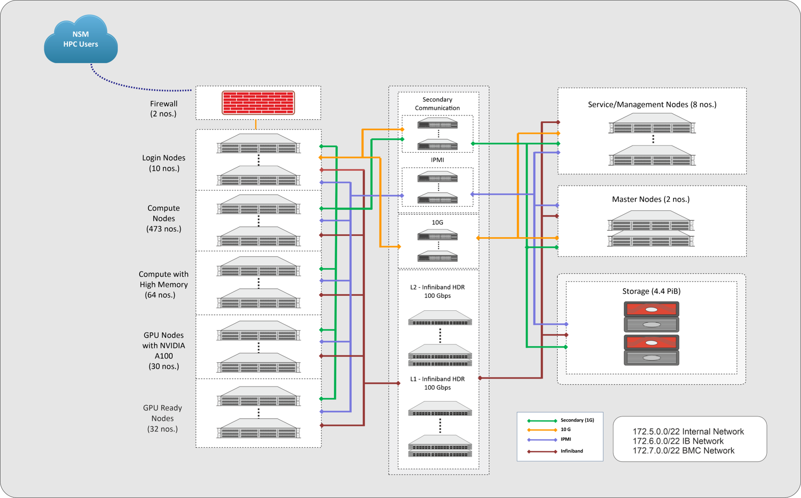

# Training of Large Language Models (LLMs) Across Different Compute Platforms

This repository contains materials for the tutorial: Supercomputing India (SCI) 2025

## Repository Structure
```
01_Basics/                 SLURM, modules, Miniconda environment setup
02_Notebook_Parallelism/   DP, TP, PP concept notebooks
03_LLM_Training_on_GPU/    DDP, Tensor, Pipeline training
04_Finetuning/             FSDP, TorchTune, Unsloth
```


## Prerequisites

* Python ≥ 3.9
* PyTorch ≥ 2.1
* CUDA ≥ 11.8
* NVIDIA GPU
* Conda / Miniconda


## Supported Topics

* Distributed Data Parallel (DDP)
* Tensor Parallelism
* Pipeline Parallelism
* Fully Sharded Data Parallel (FSDP)
* Fine-tuning workflows

## Environments
### PARAM Rudra Clusters
IUAC is a [PARAM Rudra GPU Cluster](https://nsmindia.in/access-to-param-systems/user-guides/) consisting of 65 nodes with 260 GPUs (120 of NVIDIA A100 GPUs and 140 of NVIDIA V100 GPUs). [Slurm](https://slurm.schedmd.com/) is adopted for cluster/resource management and job scheduling.

<p align="center"></p>

## Installing Conda
Once logging in to IUAC, you will need to have either [Anaconda](https://www.anaconda.com/) or [Miniconda](https://docs.conda.io/en/latest/miniconda.html) installed on your scratch directory. Anaconda is distribution of the Python and R programming languages for scientific computing, aiming to simplify package management and deployment. Anaconda comes with +150 data science packages, whereas Miniconda, a small bootstrap version of Anaconda, comes with a handful of what's needed.

1. Check the system specification
```
(base) [samritm@login10 ~]$ cat /etc/*release*
AlmaLinux release 8.10 (Cerulean Leopard)
Derived from Red Hat Enterprise Linux 8.10 (Source)
AlmaLinux release 8.10 (Cerulean Leopard)
OpenHPC release 2 (CentOS_8)
HOME_URL="http://openhpc.community"
BUG_REPORT_URL="https://github.com/openhpc/ohpc/issues"
NAME="AlmaLinux"
VERSION="8.10 (Cerulean Leopard)"
ID="almalinux"
ID_LIKE="rhel centos fedora"
VERSION_ID="8.10"
PLATFORM_ID="platform:el8"
PRETTY_NAME="AlmaLinux 8.10 (Cerulean Leopard)"
ANSI_COLOR="0;34"
LOGO="fedora-logo-icon"
CPE_NAME="cpe:/o:almalinux:almalinux:8::baseos"
HOME_URL="https://almalinux.org/"
DOCUMENTATION_URL="https://wiki.almalinux.org/"
BUG_REPORT_URL="https://bugs.almalinux.org/"

ALMALINUX_MANTISBT_PROJECT="AlmaLinux-8"
ALMALINUX_MANTISBT_PROJECT_VERSION="8.10"
REDHAT_SUPPORT_PRODUCT="AlmaLinux"
REDHAT_SUPPORT_PRODUCT_VERSION="8.10"
SUPPORT_END=2029-06-01
AlmaLinux release 8.10 (Cerulean Leopard)
AlmaLinux release 8.10 (Cerulean Leopard)
cpe:/o:almalinux:almalinux:8::baseos
```

2. Download Miniconda. Miniconda comes with python, conda (package & environment manager), and some basic packages. Miniconda is fast to install and could be sufficient for distributed deep learning training practices.

```
# (option 1) Use existing Modulefiles
[samritm@login10]$ module load miniconda

```

```
# (option 2) Miniconda (Fresh)
[samritm@login10]$ cd /scratch/$USER  ## Note that $USER means your user account name on PARAM
[samritm@login10]$ wget https://repo.anaconda.com/miniconda/Miniconda3-latest-Linux-x86_64.sh --no-check-certificate
```

3. Install Miniconda. By default conda will be installed in your home directory, which has a limited disk space. You will install and create subsequent conda environments on your scratch directory. 
```
[samritm@login10]$ chmod 755 Miniconda3-latest-Linux-x86_64.sh
[samritm@login10]$ ./Miniconda3-latest-Linux-x86_64.sh
```
## Creating a Conda Virtual Environment
You need to create a virtual envrionment for a LLM Training tutorial.

1. Create a conda virtual environment with a python version
```
[samritm@login10]$ conda create -n llm_training python=3.11 -y
Channels:
 - defaults
Platform: linux-64
Collecting package metadata (repodata.json): done
Solving environment: done

## Package Plan ##

  environment location: /home/samritm/.conda/envs/llm_training

  added / updated specs:
    - python=3.11
.
.
.
Preparing transaction: done
Verifying transaction: done
Executing transaction: done
#
# To activate this environment, use
#
#     $ conda activate llm_training
#
# To deactivate an active environment, use
#
#     $ conda deactivate
```

2. Install PyTorch, jupyter, transformers and datasets
```
[samritm@login10]$ conda activate llm_training
(llm_training) [glogin01]$ pip install torch==2.5.0 torchvision==0.20.0 torchaudio==2.5.0 --index-url https://download.pytorch.org/whl/cu121
(llm_training) [glogin01]$ pip install jupyter transformers datasets torchgpipe deepspeed nltk pybind11
```


## References

### Software & Frameworks

* Miniconda – [https://docs.conda.io/en/latest/miniconda.html](https://docs.conda.io/en/latest/miniconda.html)
* Unsloth – [https://github.com/unslothai/unsloth](https://github.com/unslothai/unsloth)
* TorchTune – [https://pytorch.org/torchtune](https://pytorch.org/torchtune)
* PyTorch – [https://pytorch.org](https://pytorch.org)
* Hugging Face – [https://huggingface.co/docs](https://huggingface.co/docs)
* Slurm – [https://slurm.schedmd.com](https://slurm.schedmd.com)

### Parallelism Documentation

* Distributed Data Parallel (DDP)
  [https://pytorch.org/docs/stable/generated/torch.nn.parallel.DistributedDataParallel.html](https://pytorch.org/docs/stable/generated/torch.nn.parallel.DistributedDataParallel.html)

* Tensor Parallelism
  [https://pytorch.org/docs/stable/distributed.tensor.parallel.html](https://pytorch.org/docs/stable/distributed.tensor.parallel.html)

* Pipeline Parallelism
  [https://pytorch.org/docs/stable/distributed.pipeline.sync.html](https://pytorch.org/docs/stable/distributed.pipeline.sync.html)

* Fully Sharded Data Parallel (FSDP)
  [https://pytorch.org/docs/stable/fsdp.html](https://pytorch.org/docs/stable/fsdp.html)

